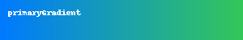

# Spinnah-Design-System

Shared design system with components, colors, and UI patterns for all Spinnah apps. 

# SpinnahDesignSystem

The **SpinnahDesignSystem** is a shared SwiftUI-based design system used across all Spinnah apps. It provides consistent visual language, modular components, and UI tokens for building beautiful and cohesive user interfaces across macOS, iOS, and visionOS platforms.

---

## ✨ Features

- Centralized design tokens:
  - Colors (`SpinnahColors`)
  - Gradients (`SpinnahGradients`)
  - Typography (Fonts)
  - Corner Radii
  - Spacing
  - Icons

- Reusable UI components:
  - Buttons
  - Cards
  - Toolbars
  - Navigation Ornaments

- Modular and lightweight Swift Package
- Supports Xcode previews and multiplatform targets

---

## 🎨 Color Tokens

Below is a list of available named colors from `Colors.xcassets`:

| Color Name                | Swatch |
|--------------------------|--------|
| `SpinnahPrimary`         |  |
| `SpinnahSecondary`       |  |
| `SpinnahAccent`          |  |
| `SpinnahBackground`      |  |
| `SpinnahBackgroundSecondary` |  |
| `SpinnahTextPrimary`     |  |
| `SpinnahTextSecondary`   |  |
| `SpinnahTextDisabled`    |  |
| `SpinnahTextPlaceholder` |  |
| `SpinnahError`           |  |
| `SpinnahWarning`         |  |
| `SpinnahSuccess`         |  |
| `SpinnahInfo`            |  |
| `SpinnahLink`            |  |
| `SpinnahOverlay`         |  |

_Note: These color values are approximations based on current theme previews._

---

## 🌈 Gradient Tokens

The following named gradients are provided by `SpinnahGradients`:

| Gradient Name       | From → To                                      | Swatch |
|---------------------|------------------------------------------------|--------|
| `primaryGradient`   | SpinnahGradientStart → SpinnahGradientEnd      |  |
| `cardBackground`    | SpinnahBackground → SpinnahBackgroundSecondary |  |
| `toolbarFade`       | SpinnahOverlay → transparent                   |  |

---

## 🧩 Usage Example

```swift
Text("Hello, Spinnah!")
    .font(.custom(SpinnahFonts.body, size: 16))
    .foregroundColor(SpinnahColors.textPrimary)
    .padding(SpinnahSpacing.medium)
    .background(SpinnahColors.background)
    .cornerRadius(SpinnahCornerRadius.medium)
```

---

## 📦 Integration

You can integrate this package into other apps using Swift Package Manager:

1. Open your project in Xcode.
2. Select **File > Add Packages...**
3. Enter the GitHub URL: `https://github.com/spinnah/spinnah-design-system`
4. Choose the latest version or main branch.

---

## 📁 Folder Structure

```
Sources/
  ├── Components/
  ├── Tokens/
  ├── Resources/
  └── SpinnahDesignSystem.swift
```

---

© 2025 Shast LeLow. All rights reserved.
